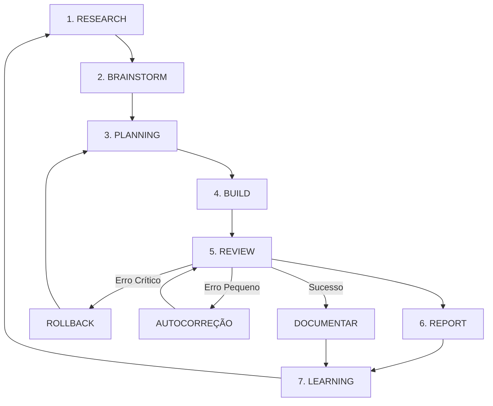

# TITANIUM LOOP ENGINE — Cérebro Operacional

> Arquétipo de funcionamento autossustentável para o ecossistema Titanium.
> O agente opera neste loop contínuo sem necessidade de refinamento manual.

---

## Filosofia

```
Pesquisar → Pensar → Planejar → Construir → Validar → Aprender → Recomeçar
```

---

## Arquitetura do Loop



---

## Módulo 1: RESEARCH

**Objetivo:** Coletar dados do mercado, concorrência e performance interna.

**Entradas:**
- Analytics do site (GA4, Meta Pixel)
- Dados do CRM
- Performance das LPs (conversão, bounce rate)
- Concorrentes diretos
- Tendências do setor financeiro/consórcio

**Saídas:**
- Relatório estruturado de oportunidades
- Problemas detectados
- Benchmarks

---

## Módulo 2: BRAINSTORM

**Perguntas automáticas:**
1. O que está convertendo melhor?
2. O que está perdendo performance?
3. Existem novas oportunidades de nicho?
4. Quais hipóteses merecem teste A/B?
5. Que conteúdo viral pode gerar tráfego orgânico?

**Saída:** Lista priorizada de iniciativas (ICE Score: Impacto × Confiança × Facilidade)

---

## Módulo 3: PLANNING

**Template de projeto:**
```yaml
projeto: [nome]
objetivo: [métrica alvo]
impacto: [alto/médio/baixo]
esforço: [horas estimadas]
prioridade: [P0/P1/P2]
etapas:
  - nome: [etapa]
    responsável: [agente]
    prazo: [data]
kpis:
  - [métrica 1]
  - [métrica 2]
dependências:
  - [dependência]
```

---

## Módulo 4: BUILD

### Estrutura de LPs (Unificada)

```
intitucionalnovo/
├── public/
│   ├── [slug-lp]/          → LP estática HTML
│   │   ├── index.html
│   │   ├── style.css
│   │   └── assets/
│   └── shared/             → Assets compartilhados
│       ├── logo-tc.svg
│       └── style-master.css
├── src/
│   ├── app/                → Next.js pages (institucional)
│   └── components/         → Componentes React reutilizáveis
└── vercel.json             → Framework: nextjs
```

### Padrão de LP (dados dinâmicos)

Cada LP segue a estrutura:
```json
{
  "slug": "uber",
  "titulo": "Pare de Pagar Aluguel de Carro",
  "subtitulo": "Crédito Veicular para Motoristas de App",
  "cta_primario": "Quero meu carro próprio",
  "cta_whatsapp": "https://wa.me/5511951014269?text=...",
  "imagem_hero": "assets/hero-driver.webp",
  "cor_tema": "#F8F7F4",
  "persona": "motorista-app",
  "tracking": {
    "google_ads": "AW-18226518834",
    "meta_pixel": "1667309107949808",
    "utm_default": "site-institucional"
  }
}
```

### Componentes Reutilizáveis (Checklist)
- [x] Header/Navbar (institucional)
- [x] Footer (institucional)
- [x] PersonaGateway (hub de LPs)
- [x] Hero section (cada LP)
- [x] Formulário de captação (cada LP via WhatsApp)
- [x] Seção de benefícios
- [x] Depoimentos/Prova social
- [x] FAQ
- [x] CTA flutuante (WhatsApp)

---

## Módulo 5: REVIEW

**Checklist de validação:**
- [ ] Build sem erros (`npm run build`)
- [ ] Todas as rotas respondem 200
- [ ] CSS carrega corretamente em cada LP
- [ ] Imagens/assets presentes
- [ ] Links do PersonaGateway apontam para URLs corretas
- [ ] Meta tags OG preenchidas
- [ ] Google Ads tag presente
- [ ] Meta Pixel presente
- [ ] Mobile responsivo
- [ ] Performance (LCP < 2.5s)

---

## Módulo 6: REPORT

**Template de relatório:**
```markdown
## Relatório de Execução — [Data]

### Mudanças Realizadas
- [lista]

### Resultados
- [métricas antes/depois]

### Problemas Encontrados
- [lista com severidade]

### Recomendações
- [próximas ações]
```

---

## Módulo 7: LEARNING

**Atualiza:**
- Base de conhecimento (este arquivo)
- Regras de design system
- Paleta de cores definida
- Prioridades do backlog
- Padrões de sucesso documentados

---

## Regras de Autonomia

### Se erro crítico:
```
→ rollback (git revert)
→ abrir relatório de incidente
→ voltar para PLANNING
```

### Se erro pequeno:
```
→ autocorreção
→ novo teste
→ REVIEW novamente
```

### Se sucesso:
```
→ documentar aprendizado
→ atualizar métricas
→ procurar próxima oportunidade
→ LOOP
```

---

## Captura de Leads (Padrão)

```json
{
  "nome": "",
  "telefone": "",
  "email": "",
  "origem_lp": "uber",
  "utm_source": "facebook",
  "utm_medium": "cpc",
  "utm_campaign": "uber-junho",
  "data": "2026-06-17T13:00:00Z"
}
```

---

## Analytics (Eventos Obrigatórios)

Todas as LPs disparam:
1. `page_view` — Visualização de página
2. `cta_click` — Clique em CTA
3. `form_start` — Início do formulário
4. `form_submit` — Envio do formulário
5. `conversion` — Conversão (WhatsApp aberto)

---

## Identidade Visual (Paleta Definida)

```css
/* ── CORES TITANIUM ── */
--bg:         #F8F7F4;     /* Fundo principal */
--bg-dark:    #0D0D0D;     /* Fundo escuro */
--bg-2:       #F0EFEC;     /* Fundo secundário */
--bg-3:       #E5E4E1;     /* Fundo terciário */
--ink:        #1A1A1A;     /* Texto principal */
--ink-soft:   #555555;     /* Texto secundário */
--ink-mute:   #888888;     /* Texto discreto */
--ink-white:  #FAFAFA;     /* Texto em fundo escuro */
--green:      #0A7B3E;     /* Verde institucional */
--green-vivid:#15B85C;     /* Verde destaque/CTA */

/* NÃO USAR: verde limão, verde neon, #00FF00, #7FFF00 */
```

---

## Memória do Sistema

### Curto prazo
- Tarefas atuais em execução
- Erros pendentes
- Deploy atual: `intitucionalnovo.vercel.app`

### Médio prazo
- 14 LPs ativas (uber, caminhão, carro-luxo, carta-contemplada, etc.)
- Institucional Next.js 16.2.9
- GitHub: `acessoriatitanium408-ship-it/intitucionalnovo`

### Longo prazo
- Design system v6 (Plus Jakarta Sans + paleta institucional)
- Estrutura de personas definida no PersonaGateway
- Copy baseada em Alex Hormozi (equação de valor)
- Viés de conversão camuflado em conteúdo de valor
