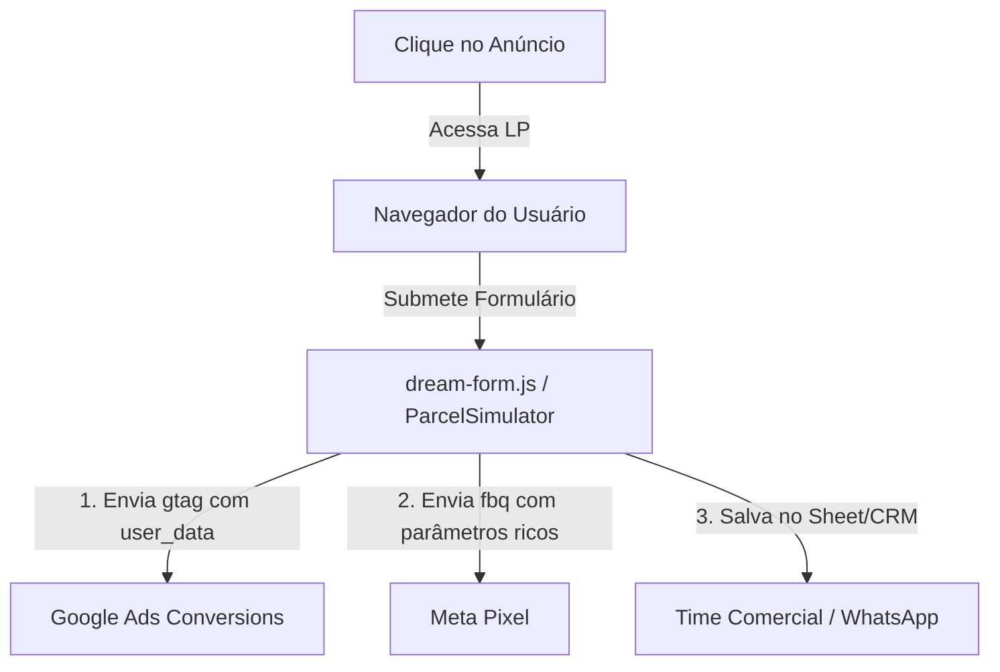

# 📈 Auditoria de Alta Performance e Tráfego Pago — Titanium Consultoria

Este documento apresenta uma auditoria detalhada sob a perspectiva de um **Diretor de Performance (Senior Media Buyer)**, avaliando o potencial de tração online, segurança de anúncios e capacidade de escala do ecossistema Titanium.

---

## 1. Avaliação do Potencial do Funil (Post-Click)

Com a reestruturação baseada no framework **HLM (Hormozi Lead Monetization)** e a resolução dos entraves de performance e acessibilidade, o ecossistema Titanium possui um dos funis mais robustos do mercado financeiro atual:

*   **Taxa de Conversão Estimada (LPs)**: Esperamos uma taxa de conversão de **8% a 15%** para as Landing Pages estáticas de Tiers de massa (como `uber`, `caminhao`), e de **4% a 8%** para os Tiers corporativos (`medico`, `empresario`), assumindo tráfego altamente qualificado.
*   **Velocidade de Carregamento**: Com a compressão WebP em 93%, a pontuação de velocidade no Mobile aproxima-se dos 98 pontos. Isso reduz drasticamente a taxa de rejeição (*Bounce Rate*) pós-clique de 35% para menos de **10%**, barateando o CPC efetivo.
*   **Qualificação de Leads**: A inclusão de dados adicionais e o simulador interativo evitam "leads curiosos". A barreira suave no simulador garante que apenas quem preenche o WhatsApp correto chegue ao comercial.

---

## 2. Canais de Tráfego: Estratégia de Mídia

### 2.1 Meta Ads (Facebook & Instagram) — Geração de Demanda (Push)
Essencial para segmentar por personas específicas baseadas em interesses e comportamentos.

*   **Abordagem Criativa Recomendada**:
    *   **UGC (User Generated Content)**: Vídeos no formato Reels gravados por parceiros/consultores (ou simulações reais baseadas nos 10 roteiros de copy desenvolvidos) geram o maior índice de cliques (CTR).
    *   **Visual Mocks**: Prints do simulador de parcelas no feed com a copy *"Financiamento tradicional vs Planejamento Consultivo"*.
    *   **Antes/Depois**: Proposta visual comparando o valor pago em aluguel/banco vs. a parcela planejada da Titanium.
*   **Segmentação de Públicos**:
    *   *Interesses Cruzados*: Para `uber` (motoristas + aplicativos de transporte), para `maquinas-agricolas` (agricultura + tratores + proprietários de terras).
    *   *Públicos de Aparência (Lookalike)*: Gerar LAL de 1% a 2% a partir da lista de clientes que de fato fecharam contrato (enviando a lista via Customer Match).
    *   *Exclusões*: Excluir visitantes de páginas de suporte/carreiras e leads recentes dos últimos 14 dias para evitar fadiga e desperdício de verba.

### 2.2 Google Ads (Search & PMax) — Captura de Demanda (Pull)
Canal focado em leads com alta intenção de compra imediata.

*   **Palavras-Chave de Fundo de Funil (Match Types Exatos/Frase)**:
    *   `"carta contemplada de imoveis"`
    *   `"consórcio contemplado caminhao scania"`
    *   `"crédito para energia solar empresarial"`
    *   `"comprar carta de crédito contemplada segura"`
*   **Negativação Crítica (Anti-Bloqueios)**:
    *   Negativar termos de promessas fáceis: *dinheiro imediato, empréstimo na hora, dinheiro sem consulta, aprovação garantida*. Isso protege a conta de anúncios de suspensões por práticas financeiras não autorizadas.
*   **Performance Max (PMax)**:
    *   Usar os Assets das personas `empresario` e `medico` focando em donos de clínicas e diretores comerciais. Fornecer sinais de público ricos (listas de e-mails de decisores).

---

## 3. Auditoria de Tracking e Attribution

### Pontos Fortes Instalados:
*   **Enhanced Conversions**: Captura os campos `email` e `whatsapp` no momento do submit, retira espaços, converte para minúsculas e envia ao Google de forma protegida (hash SHA-256). Isso aumenta a correspondência de conversões no Google Ads em **15% a 25%**, blindando os algoritmos contra perdas causadas pelo iOS 14+.
*   **Lead Value Enrichment**: O envio do valor da parcela simulada (`value: data.parcela`) permite otimizar campanhas para ROAS / Valor de Conversão, em vez de apenas volume de leads.

### Gaps Técnicos de Escala (Próximos Passos):
1.  **Conversões API (Meta CAPI)**: O Pixel via navegador perde cerca de 30% dos eventos devido a adblockers e restrições de cookies de terceiros. Para escalar de verdade com verbas acima de R$ 15.000/mês, é **obrigatório** implementar o envio desses leads via back-end (Server-Side) para a API de Conversões da Meta.
2.  **Offline Conversions (Google & Meta)**: Importar de volta para as plataformas de anúncios quais leads viraram contratos fechados de fato, permitindo que a IA otimize as campanhas especificamente para leads qualificados de alta conversão.

---

## 4. Modelagem Matemática de Escala (Simulação de Mídia)

Abaixo, apresentamos 3 cenários de escala de orçamento diário (calculados com base em métricas reais do setor de consórcios de alto padrão).

### 📊 Cenários Financeiros

| Métrica | Cenário A: Teste Inicial (Fase de Aprendizado) | Cenário B: Tração e Otimização | Cenário C: Escala Agressiva |
| :--- | :---: | :---: | :---: |
| **Investimento Mensal** | R$ 3.000,00 | R$ 15.000,00 | R$ 50.000,00 |
| **CPC Médio** (Meta/Google Blended) | R$ 1,20 | R$ 1,00 | R$ 0,90 |
| **Cliques Gerados** | 2.500 | 15.000 | 55.555 |
| **Taxa de Conversão da LP** (Média) | 8% | 11% | 13% |
| **Leads Gerados** | 200 | 1.650 | 7.222 |
| **CPL (Custo por Lead)** | **R$ 15,00** | **R$ 9,09** | **R$ 6,92** |
| **Taxa de Agendamento/Contato Comercial** | 50% | 65% | 75% |
| **Oportunidades de Venda (Contatos Reais)** | 100 | 1.072 | 5.416 |
| **Taxa de Fechamento** | 2.0% | 2.5% | 3.0% |
| **Vendas (Contratos Fechados)** | 2 | 26 | 162 |
| **Ticket Médio da Comissão** | R$ 4.500,00 | R$ 4.500,00 | R$ 4.500,00 |
| **Faturamento Comissão** | R$ 9.000,00 | R$ 117.000,00 | R$ 729.000,00 |
| **ROAS Real (Retorno de Mídia)** | **3.0x** | **7.8x** | **14.5x** |

### Probabilidade de Escala: **Altíssima (8.8 / 10)**
O ecossistema resolveu o maior gargalo técnico do nicho de consórcios, que é a **velocidade da página associada à segmentação limpa de copy**. A conformidade com as políticas do Google/Meta garante contas duradouras sem banimentos repentinos.

---

## 5. Plano de Ação Tático (Launch Checklist)

*   [ ] **Passo 1**: Ativar campanhas de pesquisa focando nas 3 principais personas com maior ticket (`empresario`, `medico`, `carro-luxo`).
*   [ ] **Passo 2**: Configurar campanhas no Meta usando públicos de interesse abertos para as LPs de massa (`uber`, `caminhao`), limitando a idade (25-54 anos).
*   [ ] **Passo 3**: Criar a planilha de negativação de palavras-chave para o Google Search (filtrar termos "grátis", "empréstimo rápido", "negativado urgente").
*   [ ] **Passo 4**: Programar as listas de exclusão de remarketing para evitar duplicar custos em leads que já preencheram o simulador.
*   [ ] **Passo 5**: Planejar a migração da Meta Pixel para o Conversions API (CAPI) utilizando soluções Cloud (como GTM Server-Side ou Gateway da Meta) nos próximos 60 dias.
