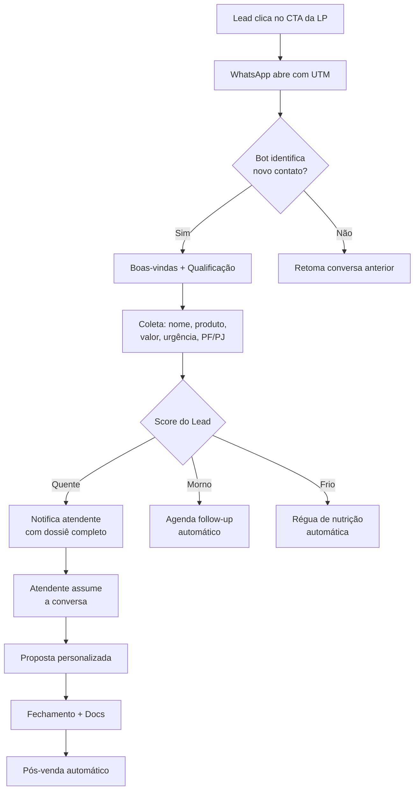

# 🧠 Brainstorm — Automação de Primeiro Contato WhatsApp
### Titanium Consultoria Financeira

---

## 1. Por que a plataforma certa importa antes do n8n

> [!IMPORTANT]
> O n8n é a ferramenta de orquestração (o "cérebro"), mas ele precisa se conectar a uma **API de WhatsApp Business**. Sem isso, não existe automação. A escolha da plataforma define o custo, a capacidade e os limites do que o atendente vai receber.

### Comparativo das principais opções

| Plataforma | Custo | Integração n8n | Multiagente | Observação |
|---|---|---|---|---|
| **Evolution API** (self-hosted) | ~R$50/mês VPS | Nativa | ✅ | Melhor custo-benefício, mais controle |
| **Z-API** | R$149–299/mês | Via webhook | ✅ | Simples, estável, BR-first |
| **WPPConnect** | Open-source | Via API REST | ✅ | Requer servidor próprio |
| **Twilio (WhatsApp)** | Pay-per-message USD | Nativa n8n | ✅ | Cara, mas 100% oficial |
| **Meta Cloud API** | Gratuito (por volume) | Via webhook | ✅ | Oficial, melhor entregabilidade |

**Recomendação: Z-API + n8n (self-hosted ou cloud)**
- Z-API é estável, tem suporte BR, webhook nativo e conecta direto no n8n sem complicação
- Se quiser escalar sem custo de mensagem: Evolution API no servidor próprio

---

## 2. O Caminho de Compra — Mapeamento Completo

```
[ANÚNCIO / LP] → [CLIQUE NO CTA] → [WhatsApp] → [Qualificação] → [Proposta] → [Assinatura] → [Pós-venda]
```

### 🔵 FASE 0 — Entrada (Topo de Funil)

O lead vem de:
- Google Ads / Meta Ads apontando para uma LP específica
- LP identifica o produto (uber, caminhão, imóvel, carta contemplada, etc.)
- O CTA abre WhatsApp com **mensagem pré-preenchida** (já sabemos o produto)

**O que a automação já sabe nesse momento:**
- De qual LP veio (URL / UTM)
- Qual produto de interesse
- Horário do contato

---

### 🟡 FASE 1 — Primeiro Contato (onde mora o maior gargalo)

**Situação atual (sem automação):**
- Lead manda mensagem
- Atendente responde quando consegue
- Não sabe nada sobre o lead
- Começa do zero toda vez

**Com automação:**
- Bot recebe, identifica, qualifica e já entrega um "dossiê" do lead para o atendente

**Perguntas críticas de qualificação (mapeamento):**

| # | Pergunta | Por quê importa |
|---|---|---|
| 1 | Qual produto tem interesse? | Roteia para o especialista certo |
| 2 | Qual o valor aproximado que precisa? | Define se é ticket adequado |
| 3 | É pessoa física ou jurídica? | Muda a abordagem e documentação |
| 4 | Tem urgência (precisa em quanto tempo)? | Define se é carta contemplada ou consórcio comum |
| 5 | Já conhece consórcio ou é primeira vez? | Calibra o nível de educação financeira necessário |
| 6 | Qual a principal dor/objetivo? | Investimento? Expansão? Troca de frota? |
| 7 | Nome e cidade | Personalização + logística |

---

### 🟠 FASE 2 — Qualificação e Roteamento

**O bot faz a triagem e classifica o lead em:**

```
QUENTE  → Tem urgência + conhece o produto + valor definido
MORNO   → Interesse real mas sem urgência
FRIO    → Apenas curiosidade / pesquisa de preço
INVÁLIDO → Número errado, concorrente, spam
```

**Com base na classificação:**
- 🔴 QUENTE → Notifica atendente AGORA com dossiê completo
- 🟡 MORNO → Agenda follow-up automático (1h, 24h, 48h)
- 🔵 FRIO → Entra em régua de nutrição (mensagens educativas)
- ⚫ INVÁLIDO → Encerra sem consumir tempo do atendente

---

### 🔴 FASE 3 — Dossiê Entregue ao Atendente

> [!TIP]
> Esse é o diferencial real. O atendente entra na conversa **já sabendo tudo**, parecendo um consultor que conhece o cliente, não um atendente de SAC lendo roteiro.

**O que o atendente recebe (no próprio WhatsApp ou CRM):**

```
📋 NOVO LEAD — TITANIUM
━━━━━━━━━━━━━━━━━━
👤 Nome: [João Silva]
📍 Cidade: [São Paulo - SP]
📱 Número: [11 9xxxx-xxxx]
━━━━━━━━━━━━━━━━━━
🎯 Produto: Carta Contemplada — Veículo
💰 Valor desejado: R$ 80.000
⏰ Urgência: Alta (precisa em até 30 dias)
🏢 PF/PJ: Pessoa Física
📚 Conhecimento: Já conhece consórcio
🎯 Objetivo: Troca de veículo para aplicativo
━━━━━━━━━━━━━━━━━━
🌐 Origem: LP Uber (Google Ads)
⏱ Contato: 14h32 | 15/06/2026
🔥 Score: QUENTE
━━━━━━━━━━━━━━━━━━
💬 Última mensagem do lead:
"Quero saber mais sobre carta contemplada"
```

---

### 🟢 FASE 4 — Proposta e Negociação

**O que a automação pode auxiliar:**
- Template de proposta personalizado gerado automaticamente
- Link para simulação com os dados já preenchidos
- Envio automático de material educativo pré-venda
- Lembrete para o atendente caso não tenha respondido em X minutos

---

### 🔵 FASE 5 — Fechamento e Assinatura

- Envio automático de documentos necessários via WhatsApp
- Checklist de documentação por tipo de produto
- Link para assinatura digital (DocuSign / Clicksign)
- Confirmação automática de recebimento

---

### ⚫ FASE 6 — Pós-venda e Reativação

- Mensagem automática de boas-vindas após assinatura
- Régua de relacionamento (30/60/90 dias)
- Pedido de indicação (boca a boca estruturado)
- Alerta de contemplação quando próxima

---

## 3. Mapa de Automações — O Que o n8n Faz em Cada Ponto



---

## 4. Gargalos Atuais que a Automação Resolve

| Gargalo | Impacto | Solução Automação |
|---|---|---|
| Lead esperando resposta por horas | Perde o interesse, vai pro concorrente | Resposta imediata 24/7 |
| Atendente começa do zero toda vez | Perda de tempo, experiência ruim | Dossiê automático |
| Sem critério de priorização | Atende o frio antes do quente | Score automático |
| Leads frios abandonados | Perda de receita futura | Régua de nutrição |
| Sem follow-up estruturado | Lead some sem decisão | Sequência automática |
| Sem registro histórico | Retrabalho constante | CRM alimentado automaticamente |

---

## 5. Integrações Sugeridas no Ecossistema

```
n8n (orquestrador)
 ├── Z-API / Evolution API (WhatsApp)
 ├── Google Sheets / Airtable (CRM simples)
 ├── OpenAI GPT-4 (interpretação de mensagens)
 ├── Google Calendar (agendamento de reuniões)
 ├── Typebot / Botpress (fluxo conversacional visual)
 └── Slack / Telegram (notificação interna da equipe)
```

---

## 6. Próximos Passos (Ordem de Execução)

- [ ] **1. Definir plataforma WhatsApp API** (Z-API recomendado)
- [ ] **2. Mapear os scripts de qualificação** por produto (Uber ≠ Imóvel ≠ Carta Contemplada)
- [ ] **3. Definir formato do dossiê** que o atendente recebe
- [ ] **4. Definir critérios de score** (o que é quente / morno / frio para a Titanium)
- [ ] **5. Montar o fluxo no n8n** com os nós conectados
- [ ] **6. Testar com volume real** antes de escalar

---

> [!NOTE]
> O maior ROI da automação não é "atender mais rápido" — é **entregar ao atendente um lead já qualificado, com contexto completo, para que ele foque 100% em fechar**.
