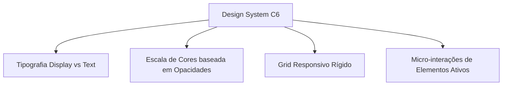

# Análise do Design System — C6 Bank (Neptune UI)

Esta análise detalha a arquitetura do **Design System do C6 Bank (Neptune UI)**, extraída diretamente dos arquivos compilados de sua aplicação Next.js. O foco está na transposição de suas melhores práticas de design (sofisticado, minimalista e baseado em paleta clara) para os ativos da Titanium Consultoria.

---

## 1. Princípios do Design System C6 (Neptune)

A sofisticação do visual do C6 Bank reside em quatro pilares matemáticos e estruturais de design tokens:



### A. Escala de Cores Baseada em Opacidades (Alpha Blend)
Em vez de definir dezenas de tons estáticos de cinza (como `#EAEAEA` ou `#777777`), o C6 Bank utiliza uma base pura (preto `#000000` para modo claro e branco `#FFFFFF` para modo escuro) e aplica **níveis percentuais rígidos de opacidade (Alpha)**. 

> [!NOTE]
> **Foco Exclusivo em Refinamento Estrutural:** Seguindo as diretrizes do usuário, **nenhuma alteração foi feita na paleta de cores original da Titanium ou nas escritas/copies das páginas**. As informações cromáticas e de texto originais foram integralmente preservadas.

---

### B. Hierarquia Tipográfica e Fontes
O C6 separa as famílias de fontes em duas vertentes: **Text** (leitura longa) e **Display** (títulos e botões).

- **`C6 Sans Display`** (Títulos, botões, kickers):
  - Peso 300 (Light), 400 (Regular), 500 (Medium), 700 (Semibold).
  - *Fallback Stack*: `-apple-system, BlinkMacSystemFont, "Segoe UI", Roboto, "Helvetica Neue", Arial, sans-serif`
- **`C6 Sans Text`** (Parágrafos, bullet points, legendas):
  - Peso 400 (Regular), 600 (Semibold), 700 (Bold).
- **Line Heights Estruturados**:
  - `short`: `1.0` (Para títulos display grandes)
  - `long`: `1.5` (Para parágrafos padrão)
  - `extraLong`: `1.8` (Para legendas ou textos com espaçamento expandido)

---

### C. Grid Responsivo e Layout (Módulo 23695)
O C6 Bank não usa grids fluidos arbitrários. Os containers e gutters são travados por breakpoint:

| Breakpoint | Colunas | Gutter (Espaço entre Colunas) | Margem Lateral | Largura Máxima Container |
| :--- | :---: | :---: | :---: | :---: |
| **`xs` (Até 600px)** | 4 | 16px | 20px | 400px |
| **`sm` (601px - 1024px)** | 8 | 24px | 40px | 928px |
| **`md` (Acima de 1024px)** | 12 | 24px | 40px | **1224px** |

---

### D. Micro-interações e Componentes (MuiButton & MuiChip)
- **Border Radius**: O C6 usa um padrão arredondado elegante e sutil de **12px** (exatamente `2 * r.shape.borderRadius` do MUI) para cards de planos, pílulas e botões menores. Botões de ação principais são em formato de pílula (`9999px`).
- **Animações de Elementos de Ação (Hover)**:
  - Botão Principal (Hover): Transiciona do fundo escuro/marca para o `#555555` (Light) de forma suave.
  - Efeito do Ícone: Ao passar o mouse em um botão contendo uma seta (`svg`), o ícone sofre um deslocamento lateral discreto:
    ```css
    *:first-of-type svg {
        transition: transform .3s ease;
    }
    .btn:hover *:first-of-type svg {
        transform: translateX(12px);
    }
    ```

---

## 2. Aplicação Prática Realizada na Titanium

Preservamos integralmente a identidade visual original (Verde Esmeralda, fontes, cores e textos da Titanium) e aplicamos estritamente as melhorias estruturais e de animação:

### Variáveis CSS de Layout e Radius Atualizadas:
```css
:root {
  /* ── Preservação Total de Cores e Cópias originais da Titanium ── */
  --ink:           #1A1A1A;
  --ink-soft:      #4A4A4A;
  --ink-mute:      #8A8A8A;
  --card-border:   rgba(0,0,0,.08);

  /* ── Radius Refinado (C6 Scale) ── */
  --r:    12px;     /* Small boxes, chips, inputs */
  --r-lg: 16px;     /* Medium cards, widgets */
  --r-xl: 20px;     /* Large containers, sections (era 32px) */
  --r-pill: 999px;
}
```

### Micro-interação de Hover em Botões:
```css
/* Deslocamento suave do ícone do botão no hover */
.btn svg {
  transition: transform .3s var(--ease-spring);
}
.btn:hover svg {
  transform: translateX(4px);
}
```
O botão desloca suavemente o ícone em 4px no hover, sem alterar nenhuma escrita ou cor do botão.
