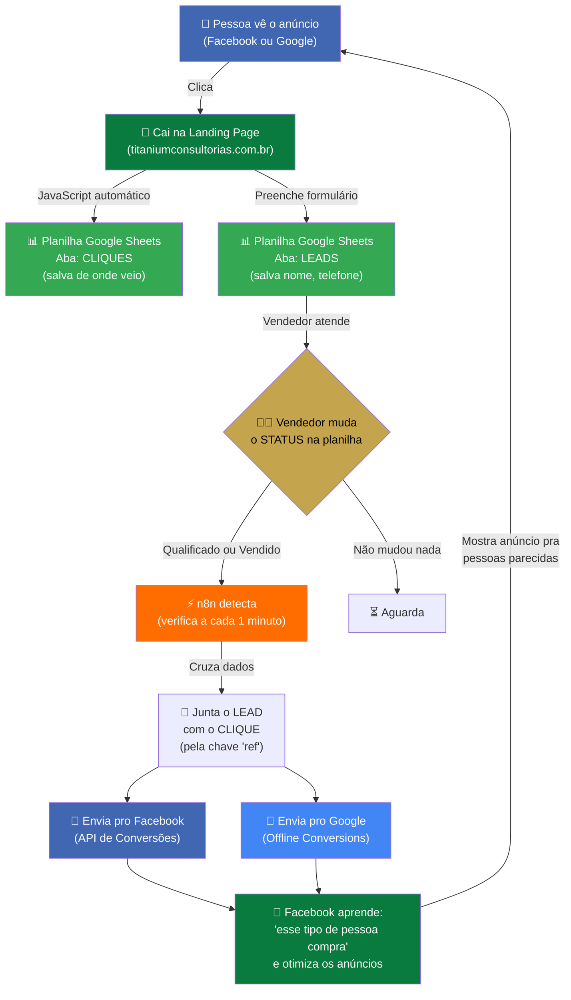

# 🔄 Ciclo Infinito de Dados — Titanium
### Como a automação funciona (explicação simples)

---

## O Resumo em 1 Frase

> **Quando alguém clica num anúncio e vira cliente, o sistema avisa automaticamente o Facebook e o Google: "esse anúncio deu resultado!" — e eles passam a mostrar o anúncio pra mais pessoas parecidas com esse cliente.**

---

## O Fluxo Visual



---

## Passo a Passo (como se fosse uma história)

### 1️⃣ O Anúncio
A gestora cria um anúncio no Facebook ou Google com um link especial que tem "etiquetas" (UTMs):
```
titaniumconsultorias.com.br/uber/?utm_source=facebook&utm_campaign=uber_junho
```
Essas etiquetas dizem: "essa pessoa veio do Facebook, da campanha uber_junho".

### 2️⃣ A Pessoa Clica
Quando clica, o Facebook/Google colam um **"crachá invisível"** nela:
- Facebook cola o `fbc` (Facebook Click ID)
- Google cola o `gclid` (Google Click ID)

### 3️⃣ Cai na Landing Page
A pessoa abre o site da Titanium. Nesse momento, um **código JavaScript automático**:
- Cria um ID único pra essa visita (`ref`)
- Lê os "crachás" do Facebook e Google
- Lê as "etiquetas" do link
- **Salva tudo na planilha, aba CLIQUES**

> 🤖 *Ninguém faz nada. É 100% automático.*

### 4️⃣ Preenche o Formulário
A pessoa coloca nome, telefone, e-mail e envia. O mesmo JavaScript:
- **Salva na planilha, aba LEADS**
- Usa o mesmo `ref` pra ligar o lead ao clique

> 🤖 *Automático também.*

### 5️⃣ Vendedor Atende
O vendedor abre a planilha, vê o lead novo, e entra em contato pelo WhatsApp.

Depois da conversa, ele abre um **dropdown** na coluna "status" e escolhe:

| Ele escolhe | Quando |
|-------------|--------|
| *(vazio)* | Ainda não atendeu |
| `Qualificado` | Conversou e o lead tem interesse real |
| `Vendido` | Fechou a venda! |

> 👨‍💼 *Essa é a ÚNICA coisa manual do fluxo todo.*

### 6️⃣ n8n Detecta a Mudança
O n8n (um robô que roda na nuvem) **verifica a planilha a cada 1 minuto**.

Quando vê que um lead mudou pra "Qualificado" ou "Vendido":
- Pega os dados do lead (nome, telefone)
- Vai na aba CLIQUES e busca o mesmo `ref`
- Encontra de onde veio (Facebook? Google?) e os "crachás"

> 🤖 *Automático. Roda 24h por dia, 7 dias por semana.*

### 7️⃣ Envia pros Algoritmos
Com tudo junto, o n8n manda uma mensagem:

**Pro Facebook:**
> "Oi Facebook, aquela pessoa com crachá `fbc_123` que clicou no anúncio da campanha `uber_junho`? Ela COMPROU. O valor foi R$3.500."

**Pro Google:**
> "Oi Google, aquela pessoa com crachá `gclid_456` que clicou no anúncio? Ela virou cliente."

> 🤖 *Automático.*

### 8️⃣ Os Algoritmos Aprendem
O Facebook e o Google recebem essa informação e pensam:

> "Hmm, a pessoa que comprou tem 35 anos, mora em SP, gosta de carros, pesquisou sobre Uber... Vou procurar MAIS pessoas parecidas e mostrar o anúncio pra elas!"

**E o ciclo recomeça.** Por isso se chama **Ciclo Infinito de Dados.**

---

## Quem Faz o Quê

| Quem | O que faz | Manual ou Automático? |
|------|-----------|----------------------|
| **Gestora de tráfego** | Cria os anúncios com UTMs | 👩‍💼 Manual |
| **JavaScript da LP** | Captura cliques e leads na planilha | 🤖 Automático |
| **Vendedor** | Muda o status do lead na planilha | 👨‍💼 Manual (1 clique) |
| **n8n (robô)** | Detecta mudanças e envia dados | 🤖 Automático 24/7 |
| **Facebook/Google** | Recebe os dados e otimiza anúncios | 🤖 Automático (IA) |

---

## Por Que Isso é Valioso?

### Sem a automação (antes):
- Gestora cria anúncio → Pessoa clica → Vira lead → Vendedor atende → **FIM**
- O Facebook/Google **nunca sabem** quem comprou
- Os algoritmos ficam **no escuro** — mostram anúncio pra qualquer pessoa
- **Desperdício de dinheiro em anúncios**

### Com a automação (agora):
- Gestora cria anúncio → Pessoa clica → Vira lead → Vendedor atende → **Robô avisa Facebook/Google**
- Os algoritmos **aprendem** quem compra
- Mostram anúncios pra **pessoas cada vez mais qualificadas**
- **Custo por venda cai** ao longo do tempo
- **Mais vendas com o mesmo investimento**

---

## O Número Que Importa

> Cada vez que o vendedor muda um status na planilha, **o algoritmo fica mais inteligente**.
>
> Com 50 conversões enviadas, o Facebook entra no modo **"otimização por conversão"** — e o custo por lead pode **cair até 40%**.
>
> **É dinheiro que volta em forma de vendas melhores.**

---

*Documento preparado por Titanium Consultoria Financeira — Junho 2026*
